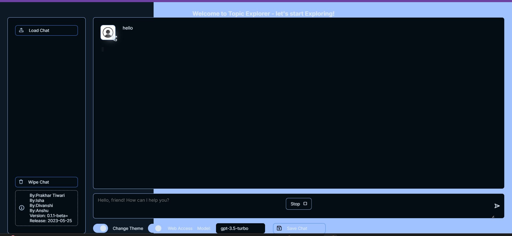

# Topic Explorer

Topic Explorer is a tool for exploring and learning various topics with the help of AI. It allows users to ask questions and get short notes on various topics using OpenAI's GPT model.

## Features
- **AI-powered Q&A:** Ask questions and get quick answers on your desired topics.
- **Real-time Processing:** Answers are processed and provided in real time.

## Screenshots
Here are some screenshots of the application:



_This is the main interface of the Topic Explorer, where you can input your question._


_Another view._

## Installation

1. Clone the repository:
   ```bash
   git clone https://github.com/your-username/Topic-Explorer.git
